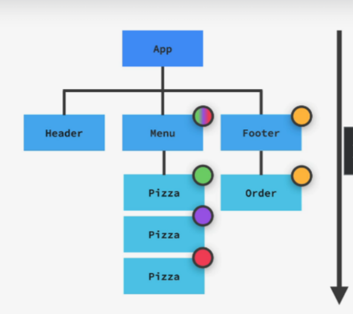

# **¿Qué son los props?**

Props es una abreviatura de "properties" y es la forma en que pasamos datos entre componentes en React, particularmente de componentes padres a componentes hijos. Se utilizan para comunicar información a través del árbol de componentes.

- _Props como configuración_: Podemos imaginar los props como configuraciones que permiten que un componente padre controle cómo debe ser y cómo debe funcionar su componente hijo.

- _Similitud con los argumentos de funciones_: En este sentido, los props son similares a los argumentos que se pasan a las funciones en JavaScript.

- _Tipos de valores_: Podemos pasar cualquier tipo de valor como props, incluidos objetos, arrays, funciones e incluso otros componentes React.

## Datos en React: props y state

- _Datos (data)_: Los datos que React usa para renderizar un componente se componen de props y state.
  - State: Son datos internos del componente que pueden ser actualizados por la lógica del componente.
  - Props: Son datos que provienen del componente padre, es decir, del exterior. El componente padre posee estos datos y el componente hijo no puede modificarlos. Solo el componente padre puede actualizar los props.

### Reglas para el uso de props

- Inmutabilidad: Los props son inmutables, es decir, no se pueden modificar y son de solo lectura.
- Mutación de datos: Si se necesita mutar datos, se debe usar state porque son datos que cambian con el tiempo.
- Inmutabilidad en el desarrollo de React: En general, un componente nunca debe mutar cualquier dato que escribamos fuera de su ámbito de función.

---

_NOTA_: ¿Por qué los props son inmutables en React?
La inmutabilidad de los props asegura un flujo de datos unidireccional, lo que facilita la comprensión y depuración del código.
Los componentes deben ser "puros" en términos de sus props y state. Esto permite a React optimizar tu aplicación y evita bugs que pueden aparecer cuando manipulas datos externos.
